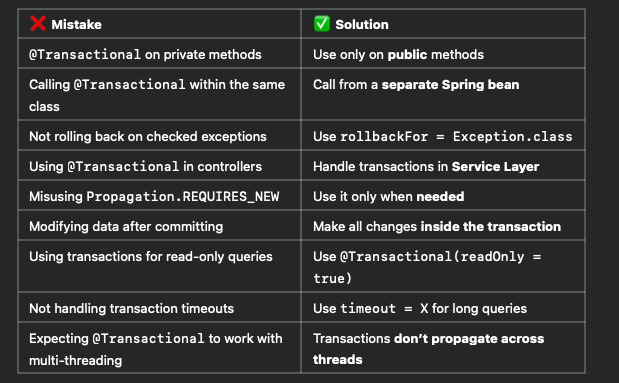

Common Mistakes & Pitfalls with @Transactional in Spring Boot

Spring’s @Transactional annotation is powerful but misusing it can lead to unexpected issues. Here are the most common mistakes developers make:

1️⃣ Using @Transactional on Private Methods

🔴 Mistake:
Spring uses proxies to manage transactions, and private methods are not proxied.

@Service
public class PaymentService {

    @Transactional
    private void processPayment() {  // ❌ Transaction won't work!
        // Transaction logic
    }
}

✅ Solution:
Use @Transactional only on public methods.

@Transactional
public void processPayment() {  // ✅ Works fine
// Transaction logic
}

2️⃣ Calling @Transactional Method from the Same Class

🔴 Mistake:
When a method calls another @Transactional method within the same class, the transaction won’t be managed by Spring (due to proxy mechanism).

@Service
public class OrderService {

    public void placeOrder() {
        saveOrder();  // ❌ Self-invocation: Transaction won't work!
    }

    @Transactional
    public void saveOrder() {
        // Transaction logic
    }
}

✅ Solution:
Call the @Transactional method from a different Spring bean or use ApplicationContext.

@Component
public class OrderServiceHelper {

    @Transactional
    public void saveOrder() {
        // ✅ Works because it's called from another bean
    }
}

@Service
public class OrderService {

    private final OrderServiceHelper orderServiceHelper;

    public OrderService(OrderServiceHelper orderServiceHelper) {
        this.orderServiceHelper = orderServiceHelper;
    }

    public void placeOrder() {
        orderServiceHelper.saveOrder(); // ✅ Now it works
    }
}

3️⃣ Ignoring Checked Exceptions & Rollback

🔴 Mistake:
By default, Spring only rolls back on unchecked exceptions (RuntimeException), but not on checked exceptions.

@Transactional
public void updateUser() throws IOException {  // ❌ Checked exception won't trigger rollback
throw new IOException("Some error occurred");
}

✅ Solution:
Explicitly define rollback behavior using rollbackFor.

@Transactional(rollbackFor = Exception.class)  // ✅ Rolls back on all exceptions
public void updateUser() throws IOException {
throw new IOException("Some error occurred");
}

4️⃣ Using @Transactional in Controller Layer

🔴 Mistake:
Transactions should be handled in the Service Layer, not in the Controller.

@RestController
public class PaymentController {

    @Transactional  // ❌ Bad practice: Controllers should not manage transactions
    @PostMapping("/pay")
    public void makePayment() {
        // Business logic
    }
}

✅ Solution:
Move transaction logic to the Service Layer.

@RestController
public class PaymentController {

    private final PaymentService paymentService;

    public PaymentController(PaymentService paymentService) {
        this.paymentService = paymentService;
    }

    @PostMapping("/pay")
    public void makePayment() {
        paymentService.processPayment();  // ✅ Transaction is handled in Service Layer
    }
}

@Service
public class PaymentService {

    @Transactional
    public void processPayment() {
        // ✅ Correct transaction management
    }
}

5️⃣ Using REQUIRES_NEW Without Understanding Its Impact

🔴 Mistake:
Using Propagation.REQUIRES_NEW always starts a new transaction and commits it independently, even if the outer transaction fails.

    @Transactional
        public void placeOrder() {
        saveOrder();  // ✅ This will rollback
        sendInvoice(); // ❌ Won't rollback even if `saveOrder()` fails
    }

    @Transactional(propagation = Propagation.REQUIRES_NEW)
    public void sendInvoice() {
        // Creates a new transaction that won't be rolled back with `placeOrder`
    }

✅ Solution:
Only use REQUIRES_NEW when absolutely necessary, like for audit logging.

6️⃣ Modifying Data After Committing the Transaction

🔴 Mistake:
A transaction commits, but then data is modified outside the transaction scope, leading to inconsistencies.

    @Transactional
    public Order createOrder() {
        Order order = new Order();
        orderRepository.save(order);
        order.setStatus("COMPLETED");  // ❌ Change happens after commit
        return order;
    }

✅ Solution:
Make all modifications inside the transaction before saving.

    @Transactional
    public Order createOrder() {
        Order order = new Order();
        order.setStatus("COMPLETED");  // ✅ Update before saving
        return orderRepository.save(order);
    }

7️⃣ Using Transactions for Read-Only Operations

🔴 Mistake:
Using transactions for simple read queries adds unnecessary overhead.

    @Transactional
    public List<User> getUsers() {  // ❌ Unnecessary transaction
        return userRepository.findAll();
    }

✅ Solution:
Use @Transactional(readOnly = true) for read-only operations, which improves performance.

    @Transactional(readOnly = true)
    public List<User> getUsers() {  // ✅ Optimized for reads
        return userRepository.findAll();
    }

8️⃣ Not Handling Transaction Timeouts

🔴 Mistake:
Long-running transactions lock database rows and degrade performance.

    @Transactional
    public void processBigData() {
        // ❌ This may take a long time, causing database locks
    }

✅ Solution:
Use timeout to automatically rollback if execution takes too long.

    @Transactional(timeout = 5)  // ✅ Rolls back if it takes more than 5 seconds
    public void processBigData() {
        // Heavy processing
    }

9️⃣ Expecting @Transactional to Work with Multithreading

🔴 Mistake:
Spring transactions don’t work across multiple threads.

    @Transactional
    public void processOrders() {
        orders.parallelStream().forEach(order -> processOrder(order));  // ❌ Each thread runs separately, no transaction management
    }

✅ Solution:
Use a single-threaded approach or manually handle transactions in separate threads.

    @Transactional
    public void processOrders() {
        for (Order order : orders) {
            processOrder(order);  // ✅ Correct transaction management
        }
    }

🔹 Final Summary

🚀 Key Takeaways 
* Understand how Spring proxies work before using @Transactional.
* Don’t use transactions where they aren’t needed (e.g., read-only queries).
* Always test rollback behavior in different failure scenarios.
* Be careful with nested transactions and REQUIRES_NEW as they may commit unexpectedly.

By avoiding these common pitfalls, you can ensure better data consistency, performance, and maintainability in your Spring Boot applications. 🚀