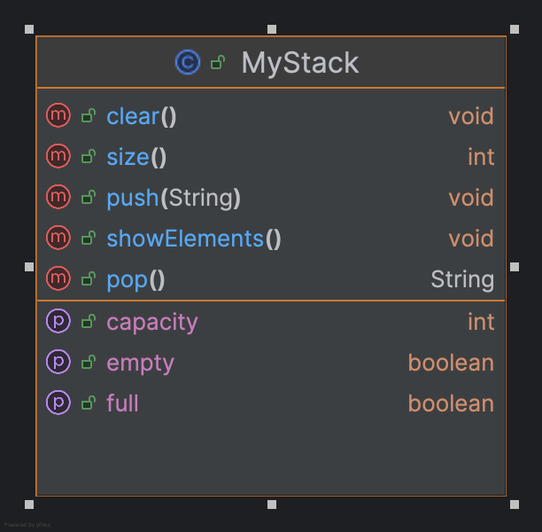

### `MyStack` Documentation

#### Class Overview:
The `MyStack` class is a basic implementation of a stack data structure using an array of strings. A stack is a collection of elements that follows the **LIFO (Last In, First Out)** principle, meaning the last element added is the first one removed.

---

### Fields:
- **MAX_STACK_SIZE**: This is a constant value that defines the maximum number of elements that the stack can hold. In this case, the maximum size is set to 10.
- **array**: This is an array that holds the elements of the stack. The size of the array is determined by `MAX_STACK_SIZE`.

---

### Methods:

#### 1. `push(String newElement)`
- **Purpose**: Adds a new element to the top of the stack.
- **Explanation**: This method should insert `newElement` into the stack if it's not already full. If the stack is full, it should give an error or do nothing.

#### 2. `pop()`
- **Purpose**: Removes the top element from the stack and returns it.
- **Explanation**: This method should remove and return the last element that was added to the stack. If the stack is empty, it should return `null` or give an error.

#### 3. `clear()`
- **Purpose**: Empties the stack.
- **Explanation**: This method should remove all elements from the stack so that it's empty.

#### 4. `isEmpty()`
- **Purpose**: Checks if the stack is empty.
- **Explanation**: This method should return `true` if there are no elements in the stack, and `false` otherwise.

#### 5. `isFull()`
- **Purpose**: Checks if the stack is full.
- **Explanation**: This method should return `true` if the stack has reached its maximum size (`MAX_STACK_SIZE`), and `false` otherwise.

#### 6. `size()`
- **Purpose**: Returns the current number of elements in the stack.
- **Explanation**: This method should return the number of elements currently in the stack (how many elements have been pushed but not yet popped).

#### 7. `getCapacity()`
- **Purpose**: Returns the maximum capacity of the stack.
- **Explanation**: This method should return the constant `MAX_STACK_SIZE`, which is the total number of elements the stack can hold.

#### 8. `showElements()`
- **Purpose**: Displays all the elements in the stack.
- **Explanation**: This method should print out all the elements currently in the stack from bottom to top.

---

### Example of how a stack works:

1. **Push**: If you push elements "A", "B", and "C" onto the stack, the stack will hold them in the order they were added.
2. **Pop**: If you then call `pop()`, the element "C" will be removed and returned (because it was the last one added).
3. **isEmpty**: If the stack is empty, calling `pop()` should return `null`.

---

This class is a starting point for building a stack data structure. The methods need to be implemented with logic to manage the elements of the stack correctly.

